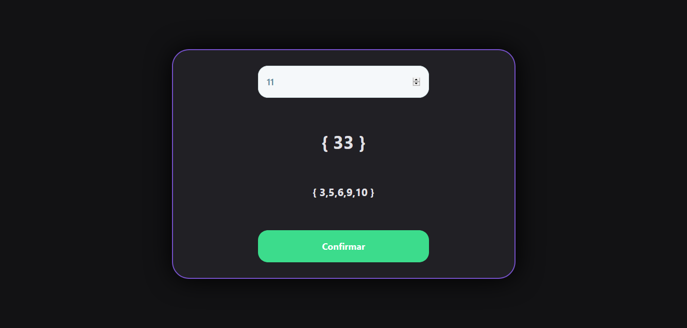

## 📌 Index
- [Sobre o projeto](#-sobre-o-projeto)
- [Screenshot](#-screenshot)
- [Instalação e Testes](#-instalação-e-testes)


## ❔ Sobre o projeto
 Este repositório foi criado para realizar o primeiro teste técnico do processo seletivo.


## 📸 Screenshot
<h1 align="center">
  
</h1>


## ⚙ Instalação e Testes

Acesse o link para visualizar o sistema:
```bash
https://pauloeduardocruz.github.io/processo-seletivo/
```

Para acessar o código baixe o arquivo zip ou clone o repositório com:

```bash
> git clone https://github.com/PauloEduardoCruz/processo-seletivo.git
```
